# Introduction to Photography

### Capturing the World

<small>By [Matthew Booe](http://www.matthewbooe.com)</small>

## About me

	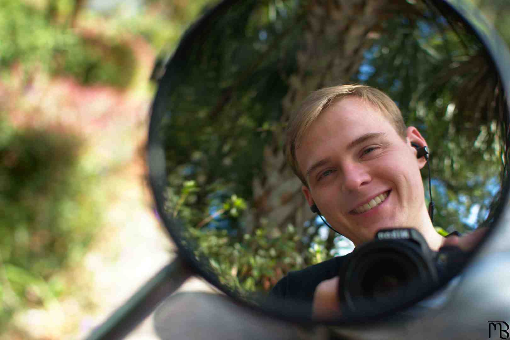</img>

Note:
- Ref: https://codecaptured.com/blog/thoughts-on/Thoughts-on-Photography/

## About me

- Photography for 5 years
- Focus on macro
- Photos at [codecaptured.com](https://codecaptured.com)

Note:
- Establish credibility, but still appear human

## Table of Content <!-- .element: style="color: #E74727;" -->

- Introduction
- Fundamentals
- Other Basics
- Cameras and Lenses
- Other Aspects
- Next Steps

## Introduction <!-- .element: style="color: #E74727;" -->

- What is it?
- Types
- Portrait

## What is it?

- Intent
- Message
- Feeling
- Just something pretty

Note:
- Not trying to be an arty person

## Types

	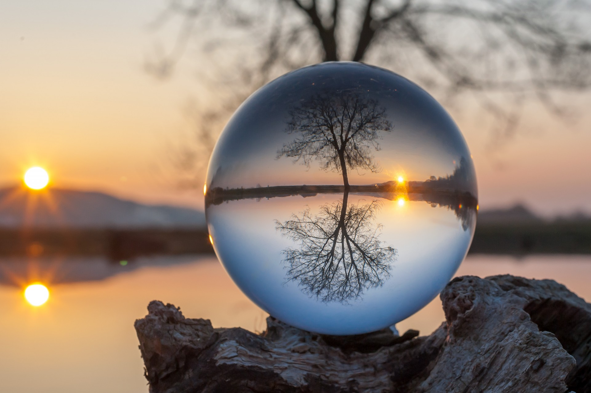</img>

Note:
- Ref: https://tdimension.wordpress.com/2016/11/30/photography-1001-crystal-ball-photography/

## Portrait

	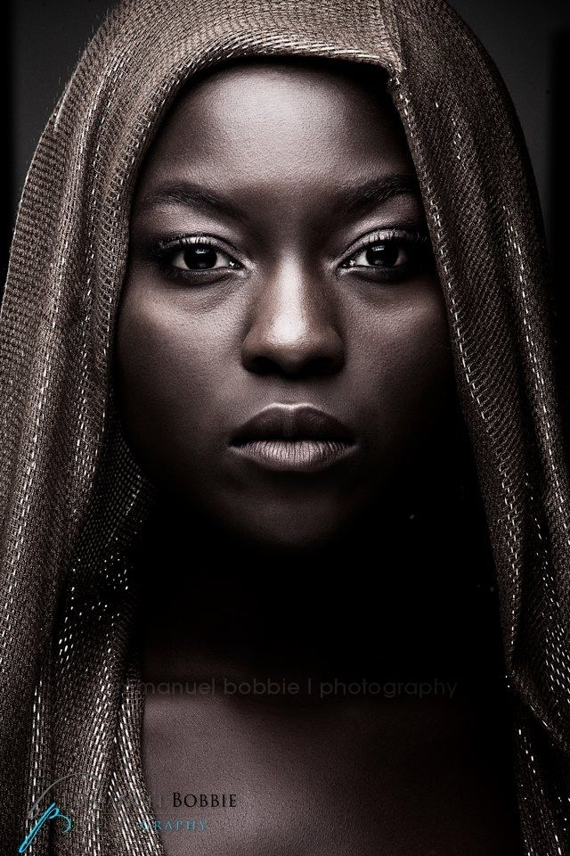</img>

Note:
- Ref: https://i.pinimg.com/originals/48/4a/0a/484a0a18d80f36d824e34ce071e1a4dd.jpg

## Landscape

	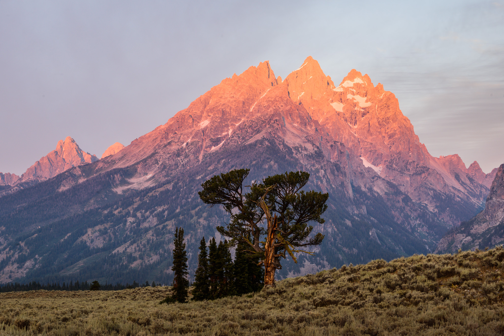</img>

Note:
- Ref: https://cdn.photographylife.com/wp-content/uploads/2017/01/Telephoto-lens-for-landscape-photography.jpg

## Street

	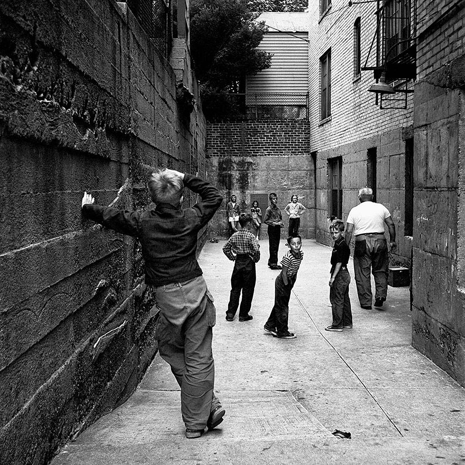</img>

Note:
- Ref: https://www.demilked.com/magazine/wp-content/uploads/2014/04/new-york-chicago-street-photography-vivian-maier-18.jpg

## Event

	</img>

Note:
- Ref: https://newznew.com/wp-content/uploads/2017/10/Event-Photography-2.jpg

## Macro

	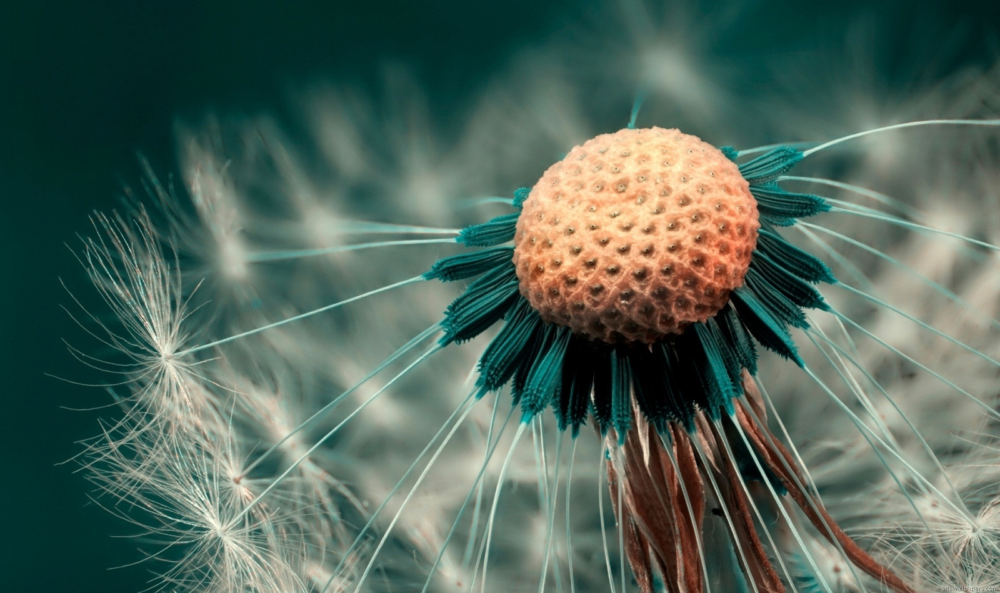</img>

Note:
- Ref: https://tdimension.wordpress.com/2016/11/30/photography-1001-crystal-ball-photography/

## Astrophotography

	</img>

Note:
- Ref: https://iso.500px.com/wp-content/uploads/2014/08/2048-7.jpg

## Architecture

	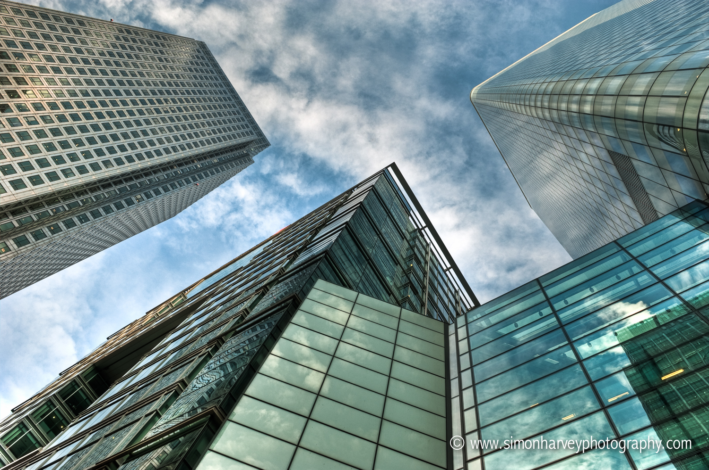</img>

Note:
- Ref: https://simonharveyphotography.files.wordpress.com/2012/11/sjh7424_25_26_27_28_29_30.jpg

## Drone

	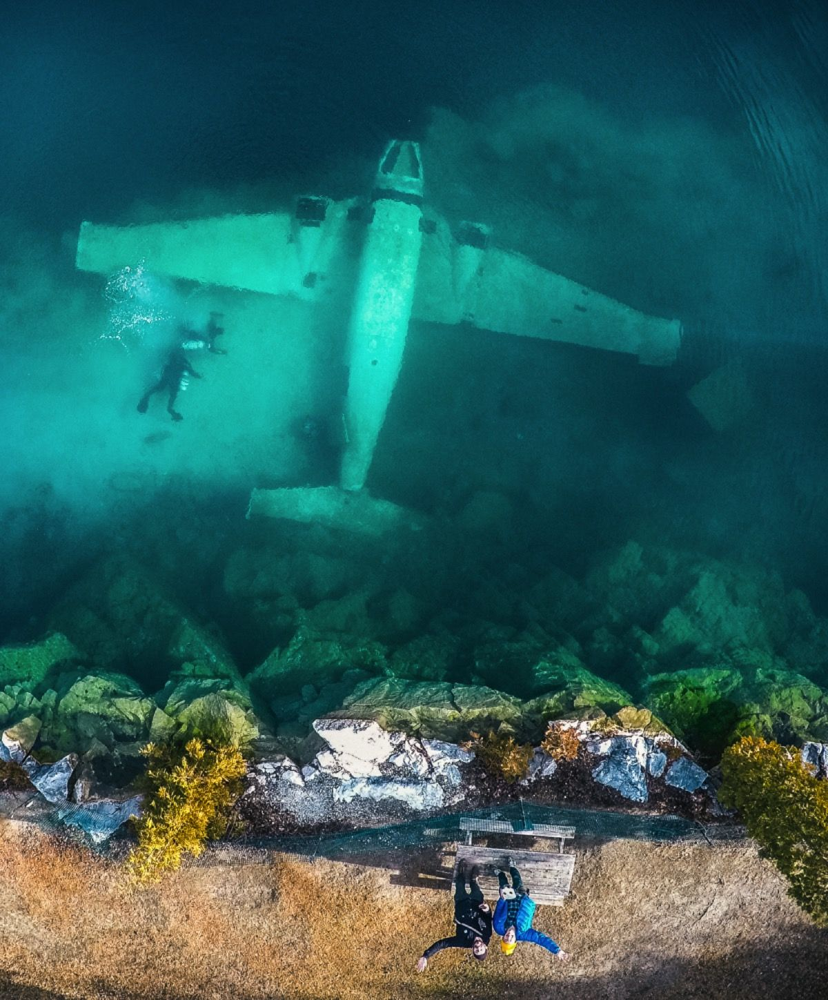</img>

Note:
- Ref: https://i.pinimg.com/originals/7d/fc/d4/7dfcd4f350bc83e49128437bf3b00e4b.jpg

## Sport

	</img>

Note:
- Ref: https://cdn.photographylife.com/wp-content/uploads/2016/08/soccer2.jpg

## Wildlife

	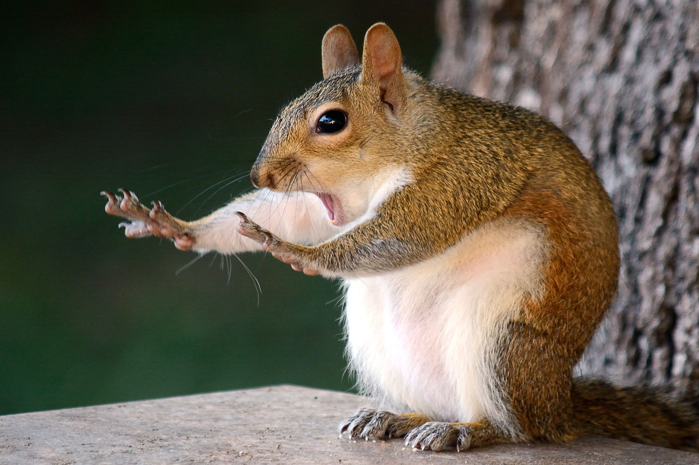</img>

Note:
- Ref: https://s23527.pcdn.co/wp-content/uploads/2018/09/Mary-McGowan_Caught-In-The-Act_00001294.jpg.optimal.jpg

## Composite

	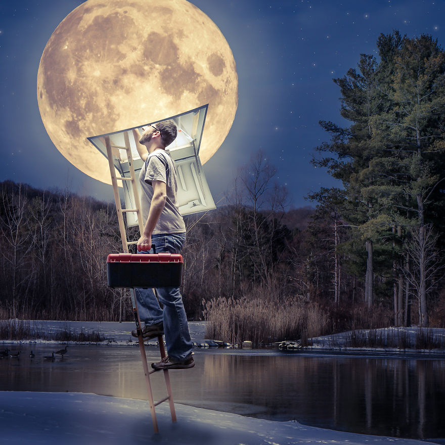</img>

Note:
- Ref: https://static.boredpanda.com/blog/wp-content/uploads/2015/07/I-Make-Surreal-Composite-__880.jpg

## Style

- Subject matter
- Color, texture, layout
- Theme
	- "To share the hidden beauty of the everyday world" <!-- .element: style="color: #E74727;" -->

Note:
- How to make your photography yours

## Fundamentals <!-- .element: style="color: #E74727;" -->

- Focus
- Composition
- Exposure

## Focus

<blockquote>
	"The distinctness or clarity of an image rendered by an optical system."
	

	<cite>thefreedictionary.com</cite>
</blockquote>

## Focus

<blockquote>
	"A center of interest or activity."
	

	<cite>thefreedictionary.com</cite>
</blockquote>

## Focus

<blockquote>
	"A plane of clarity"
	

	<cite>Me</cite>
</blockquote>

## Focus

	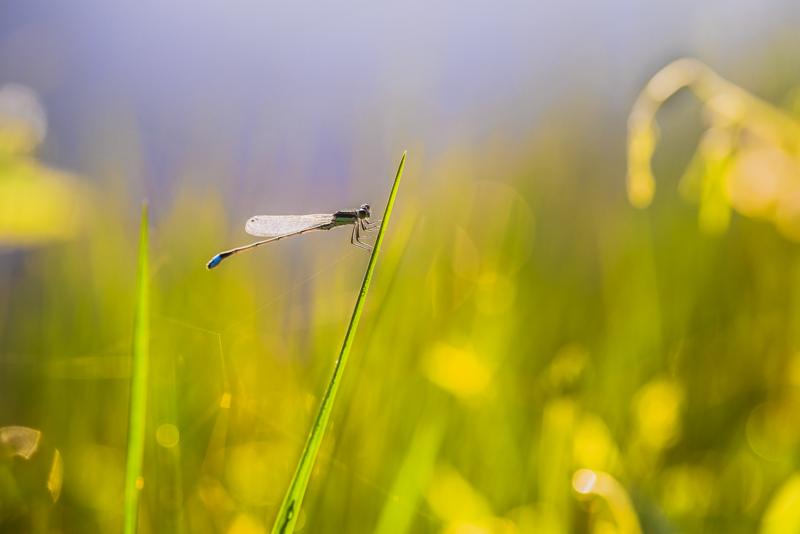</img>

Note:
- Ref: https://photographylife.com/understanding-focus-in-photography

## Manual Focus

- More control, but slow
- Auto focus can fail
	- Reflective or small items
- Good practice

## Auto Focus

- Practical and fast
- Continuous vs Single
- Area Modes

Note:
- Continuous is great for moving targets, but need to practice with it
- Different modes for the size of subject

## Practice <!-- .element: style="color: #E74727;" -->

<!-- .slide: data-background-image="images/practice-3.gif" data-background-size="70%" -->

<!-- The Gif is done kinda hack-y to make it big enough -->

Note:
- Ref: https://media.giphy.com/media/a0QlNFxlTCba8/giphy.gif

## Composition

<blockquote>
	"The manner in which such parts are combined or related"
	

	<cite>thefreedictionary.com</cite>
</blockquote>

## Composition

	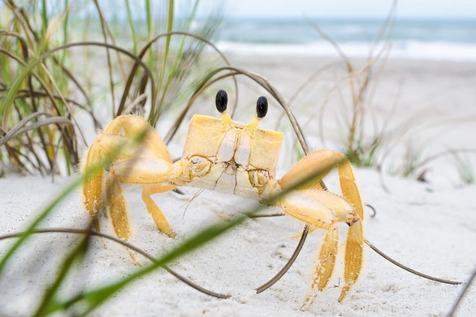</img>

Note:
- Ref: https://photographylife.com/composition-tips-for-beginners

## Points and Lines

	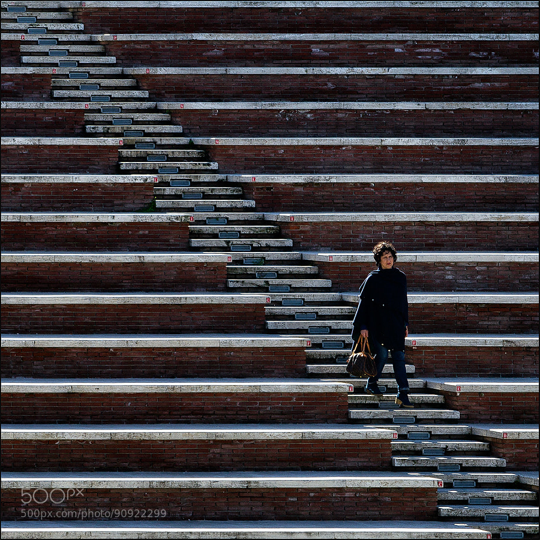</img>

Note:
- Breaking the scene and directing view
- Ref: https://drscdn.500px.org/photo/90922299/m%3D900_k%3D1_a%3D1/v2?sig=7afb73af71d1aa160051c21bd25b64e0f0d31e0f5889851a09e1d608cd33a73e

## Foreground and background

	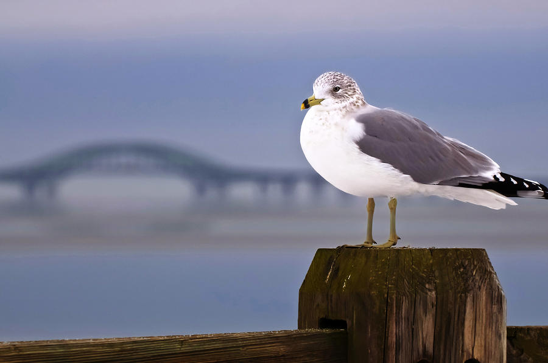</img>

Note:
- Add visual interest and more context
- Ref: https://pstbqpil.files.wordpress.com/2012/03/seagull-in-the-foreground-robert-moses-bridge-in-the-background-vicki-jauron.jpg

## Perspective

	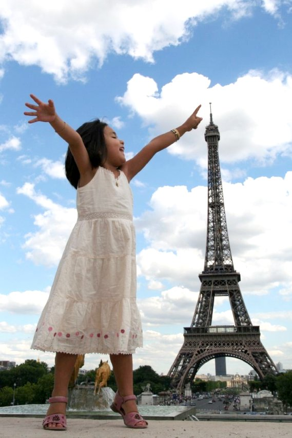</img>

Note:
- Both in a literal way and metaphorical one
- Ref: https://farm2.static.flickr.com/1192/1197168132_e13a091128_o.jpg

## Balance

	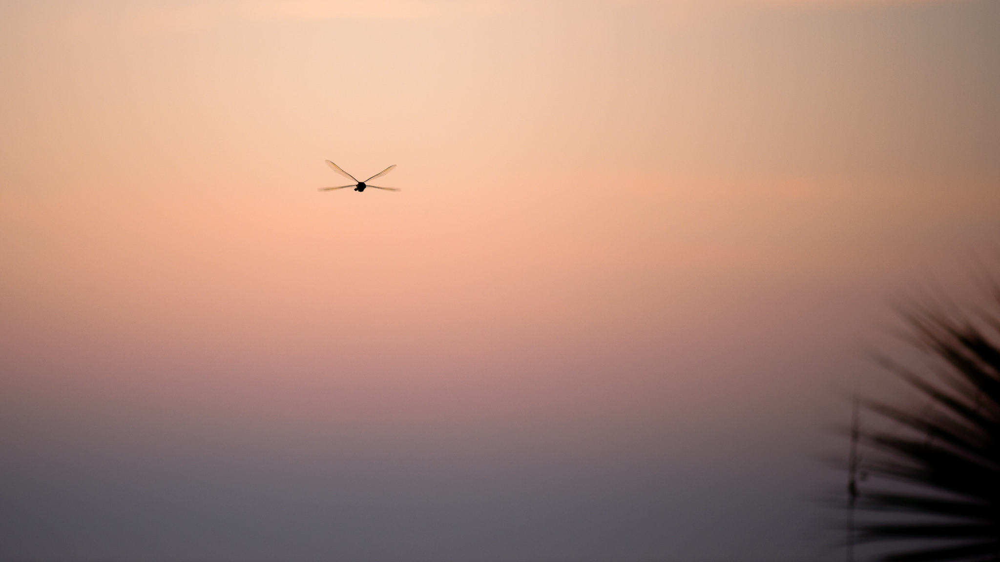</img>

Note:
- Prevent an element from overpowering, or do that on purpose
- Ref: https://cdn.photographylife.com/wp-content/uploads/2017/01/Heavy-element-balancing-lighter-element.jpg

## Space

	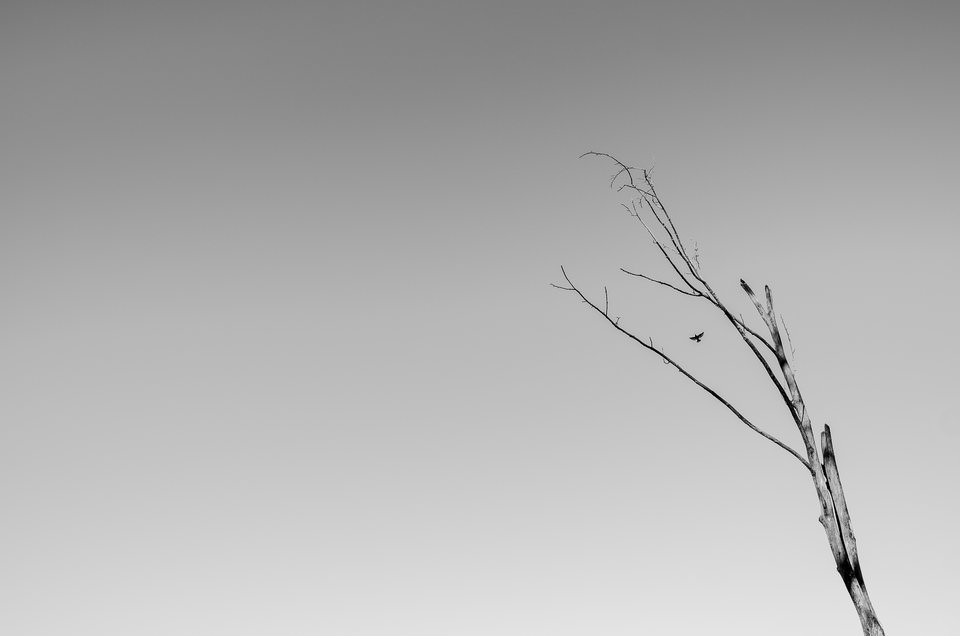</img>

Note:
- Let things breathe, lead, or stand out
- Ref: https://cdn.photographylife.com/wp-content/uploads/2017/01/Lots-of-negative-space-960x636.jpg

## Patterns

	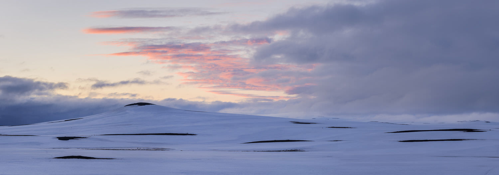</img>

Note:
- Patterns are comfortable, so think about breaking them
- Ref: https://cdn.photographylife.com/wp-content/uploads/2017/01/Similar-shape-in-rocks-and-clouds.jpg

## Presets

- Good go to
- Solid for a reason
- Rules are meant to be broken

## Rule of Thirds

	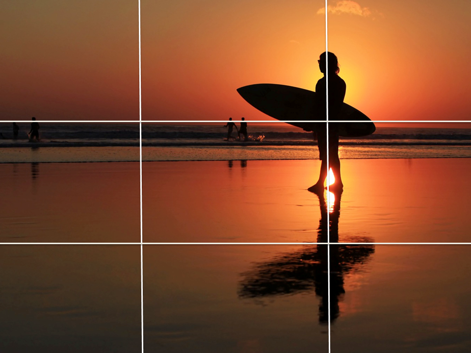</img>

Note:
- Some people split into fourths too
- Ref: https://nfoxphotography.files.wordpress.com/2014/11/rule-of-thirds-example.png

## Golden Spiral

	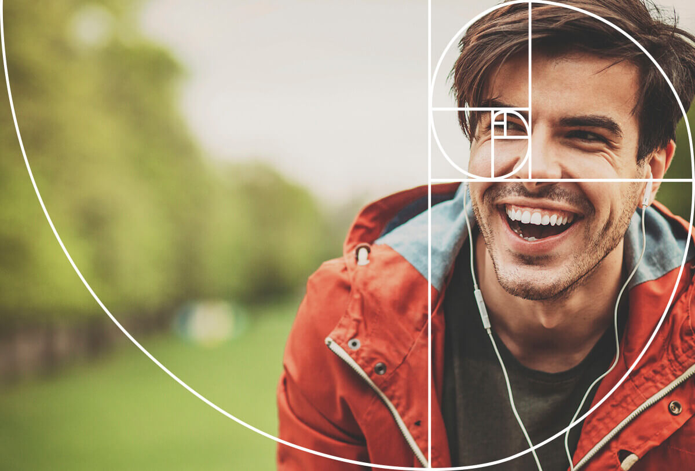</img>

Note:
- Content filling this space, people look at eyes
- Ref: https://www.picmonkey.com/blog/wp-content/uploads/2016/09/Golden-ratio-portrait.jpg

## Practice <!-- .element: style="color: #E74727;" -->

<!-- .slide: data-background-image="images/practice-2.gif" data-background-size="70%" -->

Note:
- Ref: https://66.media.tumblr.com/3c451c21479835579118ff84a97c5976/tumblr_ouvxc3O5Gb1qbrivdo1_500.gif

## Exposure

<blockquote>
	"The amount of light per unit area"
	

	<cite>thefreedictionary.com</cite>
</blockquote>

## Exposure

<blockquote>
	"Determines the brightness or darkness of an image, and more"
	

	<cite>wikipedia.com</cite>
</blockquote>

## The Triangle

- Three balancing components
	- Aperture
	- Shutter Speed
	- ISO
- Manual vs Priority mode

Note:
- Manual gives you full control
- Priority lets you control one components and it auto does the others

## Aperture

- The size of the opening in a lens
- f/32 is small, f/2 is large
- Affects depths of field

Note:
- Measured in f-stops, size of opening / actual size
- We will discuss depth of field more later, but smaller aperture will produce small depth of field

## Aperture

	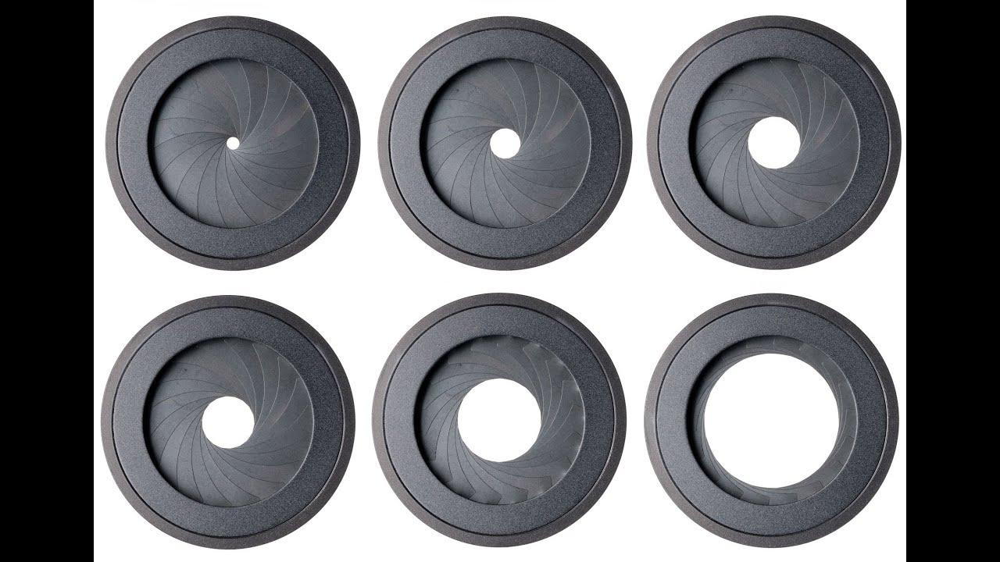</img>

Note:
Ref: https://i.ytimg.com/vi/F8T94sdiNjc/maxresdefault.jpg

## Shutter Speed

- Amount of time the senor is exposed
- 1/300s vs 5 minute
- Longer = more light
- Keep in mind subject

Note:
- Measured in fractions of a second to minutes
- Tripod helps to increase length of time, because hands shake to much, even when propped

## Shutter Speed

	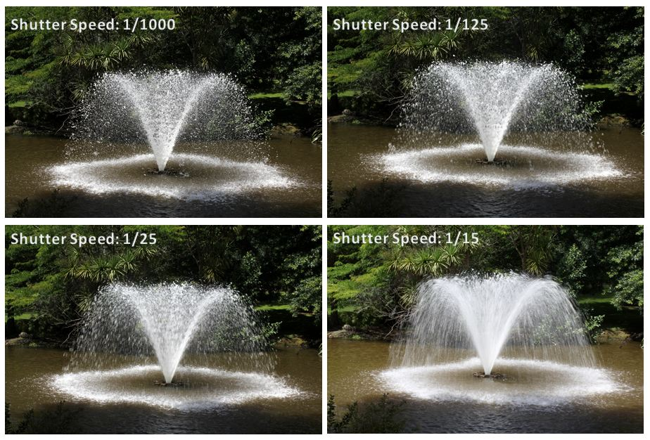</img>

Note:
- Ref: https://3.bp.blogspot.com/-nCTwM2AKTb4/T_tEO1NRXtI/AAAAAAAAAiM/JH0ak56vQjM/s1600/ShutterSpeed+pic.JPG

## ISO

- Camera's sensitivity to light
- Artificially brightness an image
- More is brighter but causes "noise"

## ISO

	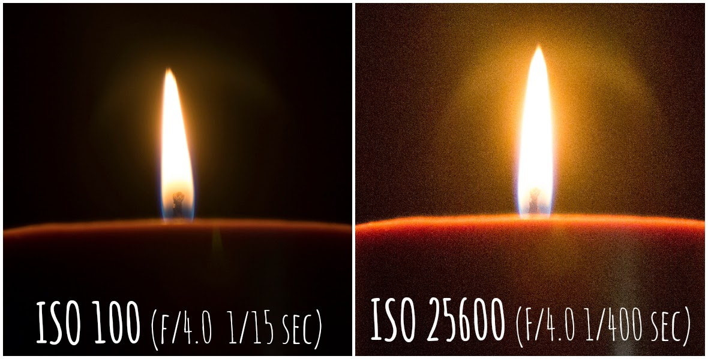</img>

Note:
- Ref: https://withmanish.com/wp-content/uploads/2017/10/What-does-ISO-Do.jpg

## Long Practice <!-- .element: style="color: #E74727;" -->

<!-- .slide: data-background-image="images/practice-4.gif" data-background-size="70%" -->

Note:
- Ref: https://i.kinja-img.com/gawker-media/image/upload/t_original/snj3tg8nceomsjnq7xpx.gif

## Other Basics <!-- .element: style="color: #E74727;" -->

- Sharpness
- Depth of Field
- Lighting
- White Balance
- Focal Length
- Field of View

## Sharpness

- The clarity of detail in the image
- Affected by
	- Color contrast
	- Light
	- Depth of field

## Sharpness

	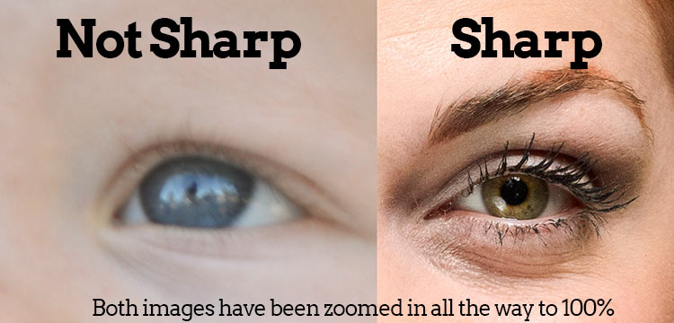</img>

Note:
- Ref: https://improvephotography.com/wp-content/uploads/2014/07/sharpness-eyes-example.jpg

## Depth of Field

- Distance between the closest and farthest sharp points
- Wider aperture = smaller
- Closer = smaller

## Depth of Field

	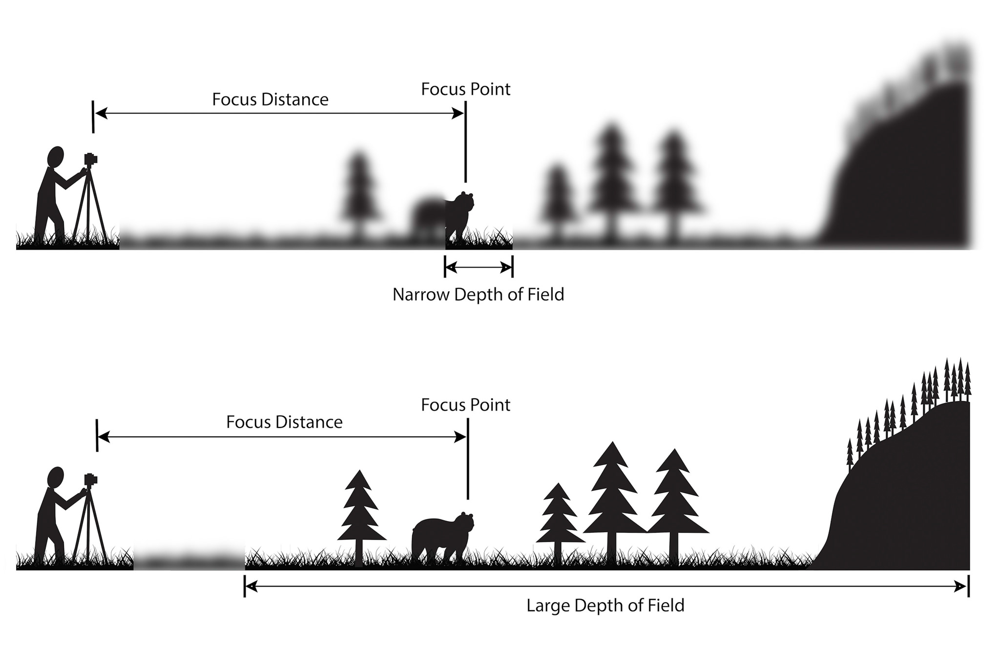</img>

Note:
- Ref: https://photographylife.com/what-is-depth-of-field

## Lighting

- Electromagnetic radiation?
- More than just how much

Note:
- Wasn't sure how to describe it, hope everyone understands this

## Position

	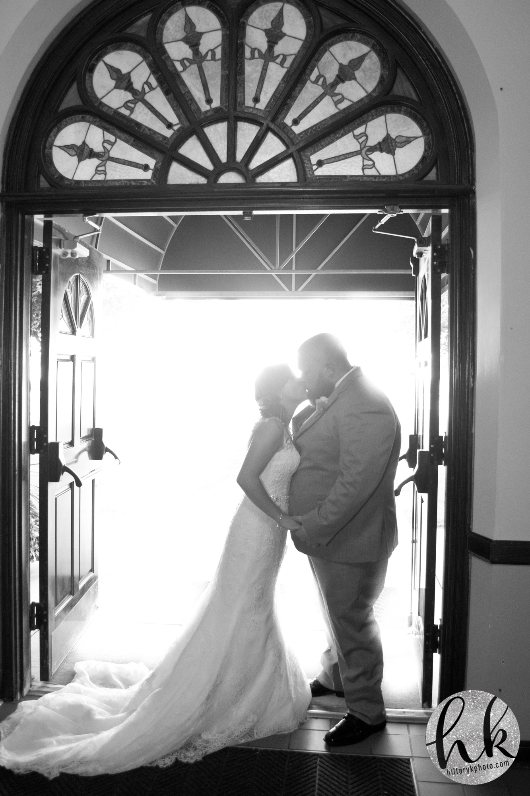</img>

Note:
- Behind, above, in front, to the side, all affect the feeling
- Ref: https://www.creativelive.com/photography-guides/lighting-for-beginners

## Hard

	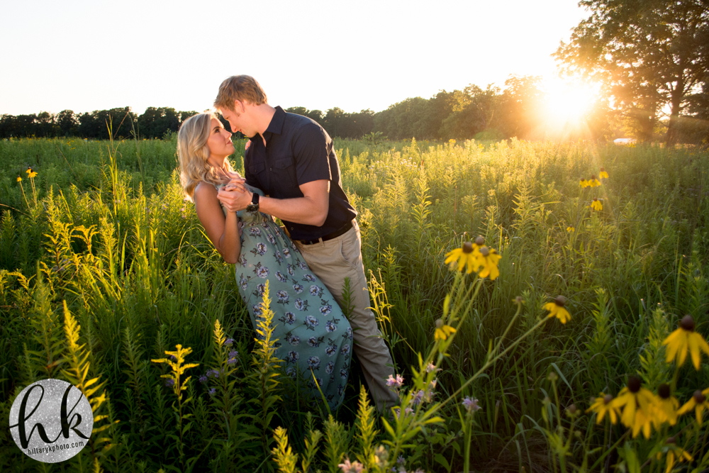</img>

Note:
- Hard causes noticeable shadows and back lighting
- Ref: https://www.creativelive.com/photography-guides/lighting-for-beginners

## Soft

	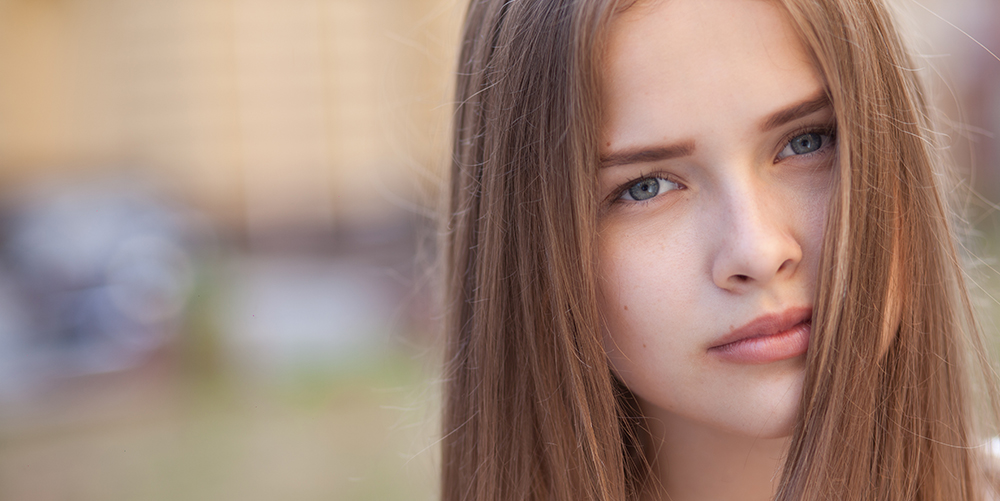</img>

Note:
- Soft is lack of shadow, smoother quality
- Ref: https://pbblogassets.s3.amazonaws.com/uploads/2015/08/Soft-Lighting-Outside-Example.jpg

## Color

	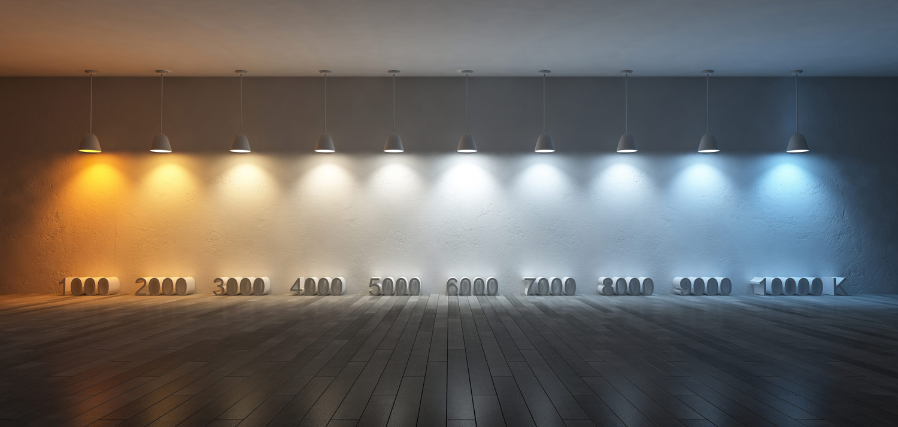</img>

Note:
- Measured in kelvin
- Ref: https://www.creativelive.com/photography-guides/lighting-for-beginners

## Options

- Time of day
- Weather
- Indoor vs outdoor
- Do it yourself

## White Balance

- The shade of white influenced by lighting
- Warmer = reds and yellows
- Cooler = blues and purples
- Use white card or camera presets

Note:
- Can change white balance to adjust in-camera style
- Usually want a proper white for easier editing

## White Balance

	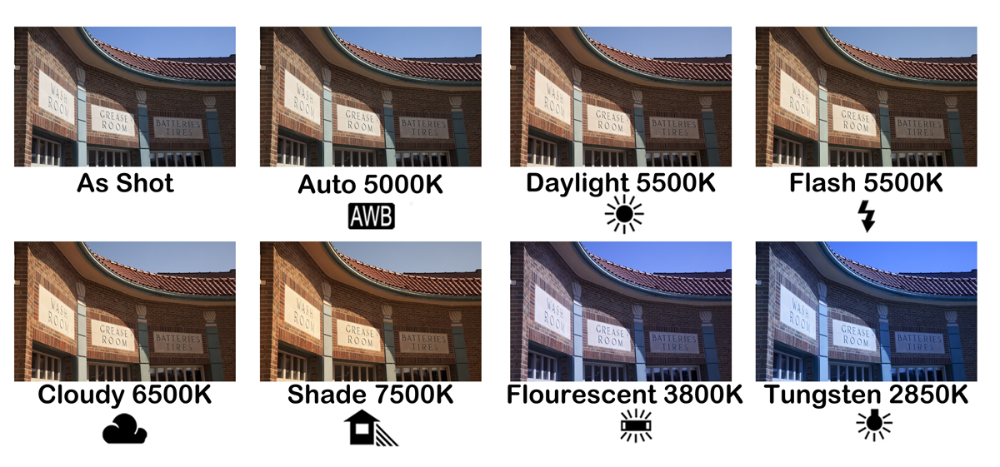</img>

Note:
- Ref: https://www.louisdallaraphotography.com/wp-content/uploads/2012/12/white-balance.jpg

## Focal Length

- Magnification of an image
- More length = more magnification
- 50mm is considered true

Note:
- Property of a lens
- Measured in mm
- True means like our eyes see

## Focal Length

	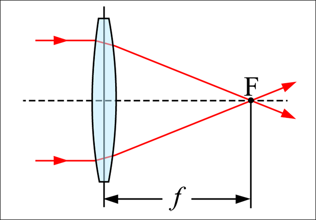</img>

Note:
- Ref: https://www.howtogeek.com/353144/what-is-focal-length/

## Focal Length

	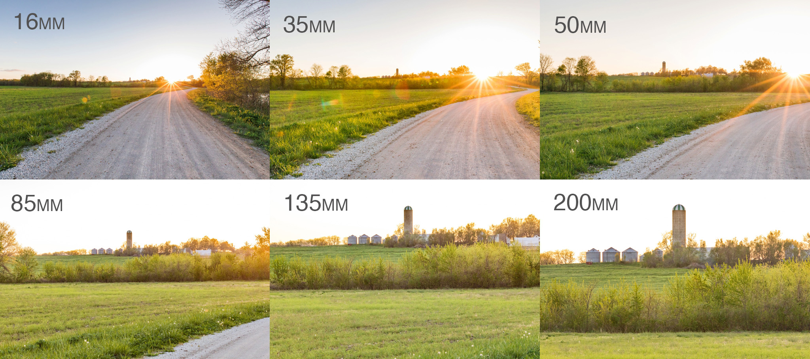</img>

Note:
- Ref: https://www.colesclassroom.com/wp-content/uploads/2017/04/1_GRID-Focal-Length-1_BLOG_final.jpg

## Field of View

- How wide an angle an image is
- More length = more narrow

Note:
- Property of a lens
- Related to focal length

## Field of View

	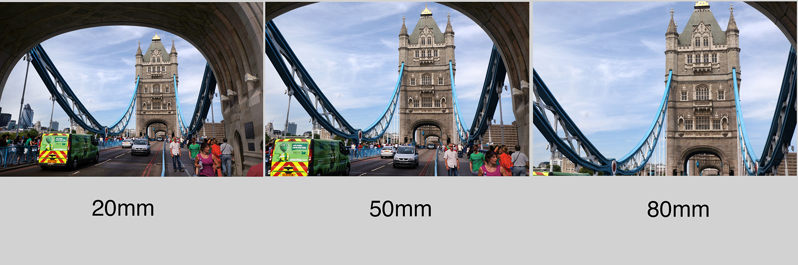</img>

Note:
- Ref: https://arqspin.com/wp-content/uploads/2013/11/field-of-view-copy.jpg

## Cameras and Lenses <!-- .element: style="color: #E74727;" -->

- Lens types
- DSLR vs Mirrorless
- Crop vs Full Frame
- Smartphone
- Other

## Lens types

- Lots of factors
- No "right" lens

Note:
- But there are often more suited lenses

## Length

- Focal length
- Field of view

Note:
- Like we just discussed

## Prime vs Variable

- Prime
	- "Faster", sharper, smaller, cheaper
- Variable
	- Versatile, need less lenses
- Not definitive

Note:
- Faster refers to bigger aperture, because you can take in more light in less time
- There are nice variable lenses that outperform primes
- There are specialized primes that are more expensive and heaver

## Holy trinity

- 16-35mm
- 24-70mm
- 70-200mm

Note:
- The idea is this covers all normal basis, but your needs will vary

## Mount type

- Physical connection to camera
	- Also electronic communication
- Manufactures can have multiple types
- Adapters to mix and match

Note:
- Electronics are used for things like auto focus and object tracking
- Each camera manufacture has at least one type of mount

## Other

- Stabilization
- Size/weight
- Full vs crop
- Specialization

Note:
- Stabilization accounts for hand movement, may create noise
- Specialization like super telephoto or macro for product or insect photography

## DSLR vs Mirrorless

- Two styles of cameras
- Different technologies
- Similar use

## DSLR

- Mirror that physically moves light to viewfinder
- Viewfinder is real time
- Older, cheaper, better battery, more lenses

Note:
- Digital Single Lens Reflex Cameras
- Viewfinder has no electronic delay
- Less electronics mean less power draw
- More lenses because those mounts have been around longer

## Mirrorless

- No mirror, viewfinder is screen
- Viewfinder shows what will be captured
- Newer tech, smaller/lighter

Note:
- Can not overstate how useful it is to see what the actual exposure being captured is
- Lenses can also be smaller to match the form factor, off load electronics
- My suggestion is to start with an entry level DSLR, because of costs, but get lenses that could work for mirrorless
- Also, need more sensor cleaning (which must be delicate), because no extra protection from mirror

## Full Frame vs Crop

- Size of the sensor
- Lenses support

Note:
- Depending on the mount, you might not be able to use a crop lens on a full frame camera or vice versa

## Full Frame

- Same as old 35mm film, industry standard
- Focal lengths are "true"
- Higher resolution, more light

Note:
- True refers to the old industry standard
- Full frame usually has nicer and more expensive options, for "professional" use

## Crop

- Smaller than full, no standard
- Increase the magnification relative to full
- Cheaper, smaller cameras

Note:
- Each manufacture usually standardizes a crop ratio, like 1.5x (full frame)

## Smartphone

- "The best camera is the one you have with you"
- Pro mode
- Some control of exposure
- RAW format

Note:
- Smartphones also use a lot of image processing

## Other

- Lighting or mic accessories
- Type of SD card
- Size of battery
- Customization
- Software experience

Note:
- Manufacture have lots of varying accessories to consider
- Nicer cameras might require more expensive SD cards
- Customization refers to how much you can tweak cameras settings to better control it

## Other Aspects <!-- .element: style="color: #E74727;" -->

- RAW vs JPEG
- Editing
- Organizing
- Sharing

## RAW vs JPEG

- RAW is a series of formats
	- Collect more data for editing
- JPEG are smaller, easier to share

Note:
- Setting in camera, RAW is preferred if you want to edit
- Size of photos makes a huge difference in storage size

## Editing

- Improve images or more artsy
- Lots of software
	- [Darktable](https://www.darktable.org/)
	- [Lightroom](https://lightroom.adobe.com/)

## Change

- Brightness
- Color
- Contrast
- Noise
- Aspect ratio

Note:
- More than this, but this is the core

## In Camera

- Don't rely on editing
- Filters
- Gels

Note:
- While learning, try getting it right in camera first
- Editing takes a while to get used to too
- Filters can polarize, protect, graduated density
- Gels colorize

## Organizing

- Folder hierarchy by date
- Software to tag and organize photos
	- [digiKam](https://www.digikam.org/)
	- [Lightroom](https://lightroom.adobe.com/)

Note:
- There are many techniques, these are just my suggestions
- Tag by location or style
- Some can recognize people too

## Sharing

- Sites have rights to your content
- Watermarks and metadata
- Alt text

Note:
- Each site is different, but generally can always hold on to it, but can advertise too
- Metadata can be stripped
- Accessibility to describe the image

## Next Steps <!-- .element: style="color: #E74727;" -->

- Make a commitment
- Grow skills

## Make a commitment

- Use your phone
- Take photos with intent
- Rent cameras and lenses

Note:
- Use your phone

## Grow skills

- Find photographers you like
- Submit work to art shows or contest
- Join groups for comments and critiques

Note:
- Learn from the style of a photographer

## Questions? <!-- .element: style="color: #E74727;" -->

## Thank you!

<!-- .slide: data-background-image="images/thank-you.gif" data-background-size="70%" -->

Note:
- Ref: https://thisweekinpinball.com/wp-content/uploads/2018/03/IsBHReF.gif

## Long Practice <!-- .element: style="color: #E74727;" -->

<!-- .slide: data-background-image="images/practice-5.gif" data-background-size="70%" -->

Note:
- Ref: https://i.pinimg.com/originals/27/74/7a/27747aa8ba697e52c9dfe6dfc1250ddf.gif
