# How the Florida Flag Came to Be

### A mostly factual telling

<small>By [Florida Man](http://www.matthewbooe.com)</small>

Note:
- References added as links throughout the presentation and in source

## Why?

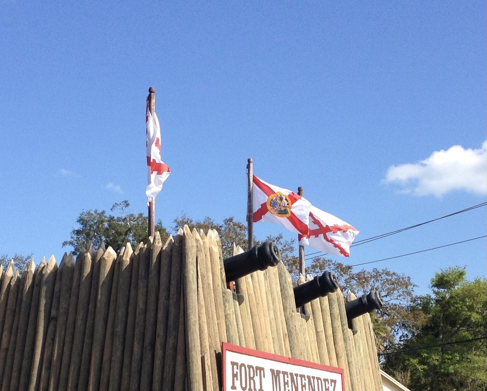

Note:
So, I'm scrolling through Wikipedia, like any normal person, to make an informed rant about how it's disingenuous at best, that [Florida][Florida] was named the "land of flowers". However, before I got into the meat of it, I saw a picture. This picture in fact! And that lead me to discover a very interesting flag fact! 

## Spain

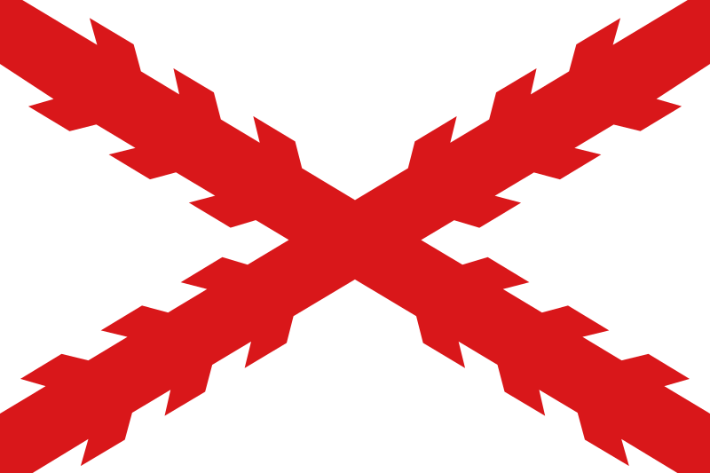

Note:
In the [before time][Florida Flags], Spanish Florida (as with other territories claimed by [New Spain][New Spain]) used the [Cross of Burgundy][Cross of Burgundy] as their flag. Which you know, looks dope! It's simple, but has this saw tooth look that just really stands out.

## Charles the Bold

Note:
Now, why would Spain use a [Burgundy][Burgundy] thing? That's like, not in Spain! Well we can blame our old friends the Habsburgs! They "inherited" Burgundy after the previous owner, [Charles the Bold][Charles the Bold], caught the dead.
> Side note: Apparently there weren't many names or adjectives in the 1400s, because Charles the Bold here got into a fight with Philip the Good, who is the grandson of Philip the Bold. I'm just glad we have more names now, otherwise I might be Matthew the Strange.

## Blame the Habsburgs

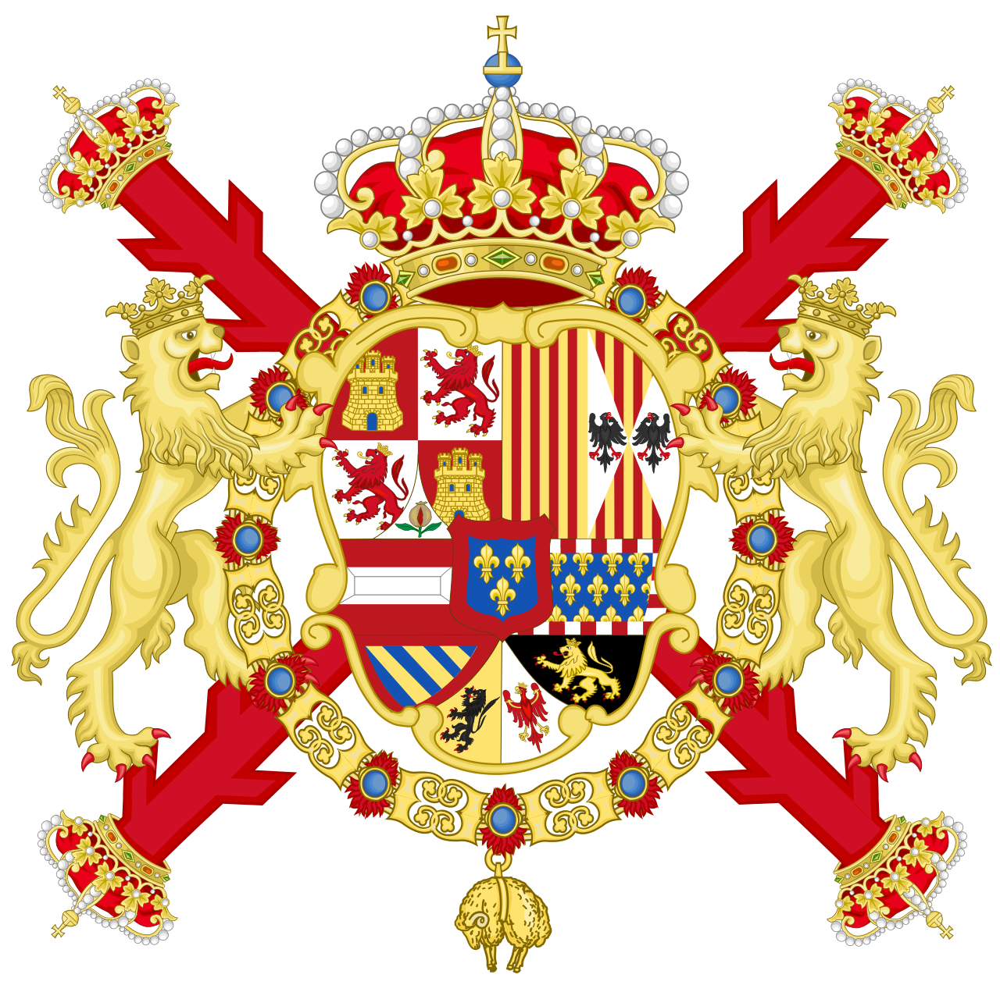

Note:
Anyway, after the Habsburgs realized this flag was way cooler than anything else they had, they started using it a lot. Particularly when the Habsburgs did what they do best and intermarried with other royal families to stave off the inevitable downfalls of interbreeding just a little bit longer! Oh and they also took over Spain. 
Unfortunately, they also liked to throw a lot of gaudy nonsense over that cool cross. Hugh, some people just can't appreciate good design.

## Ponce de León

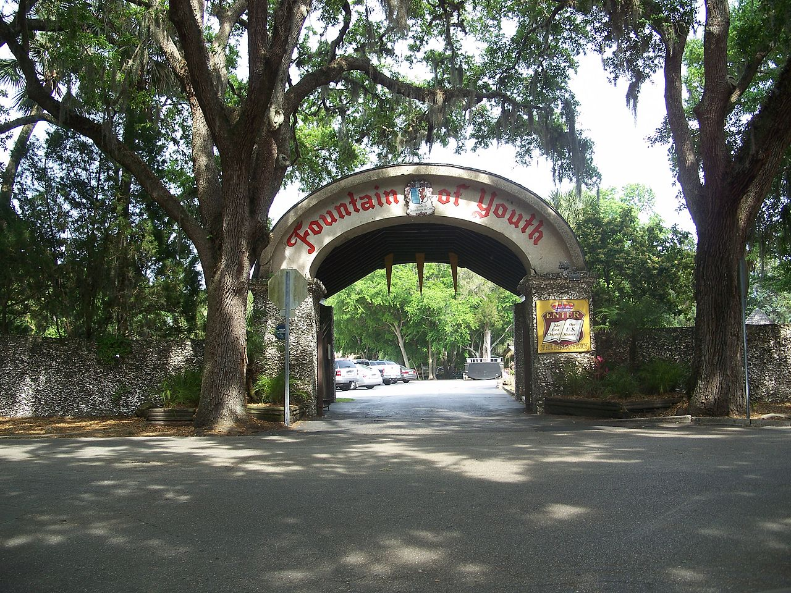

Note:
Eventually, good ol "I want to be young forever" Ponce de León set out to establish a [cheesy theme park][Fountain of Youth Park] in Florida, since the other conquistadors already murdered and pillaged the rest of the known "New World".
Oh and he also brought over that flag! Fortunately, he (or you know, probably someone else) realized how awesome it was and just kept the standard red cross-y bits.

## Great Britain

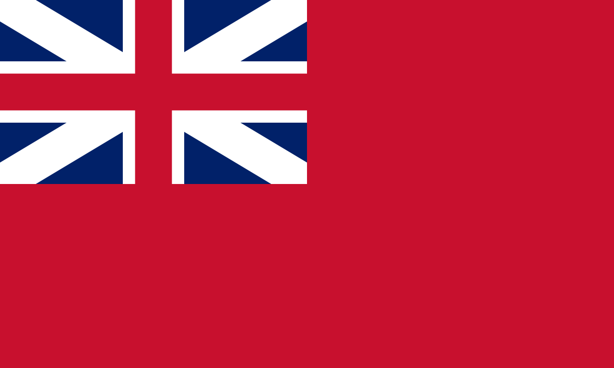

Note:
Next, lots of things happen! Spain lost control of Florida to Great Britain, than got it back. 

## The Republic of West Florida

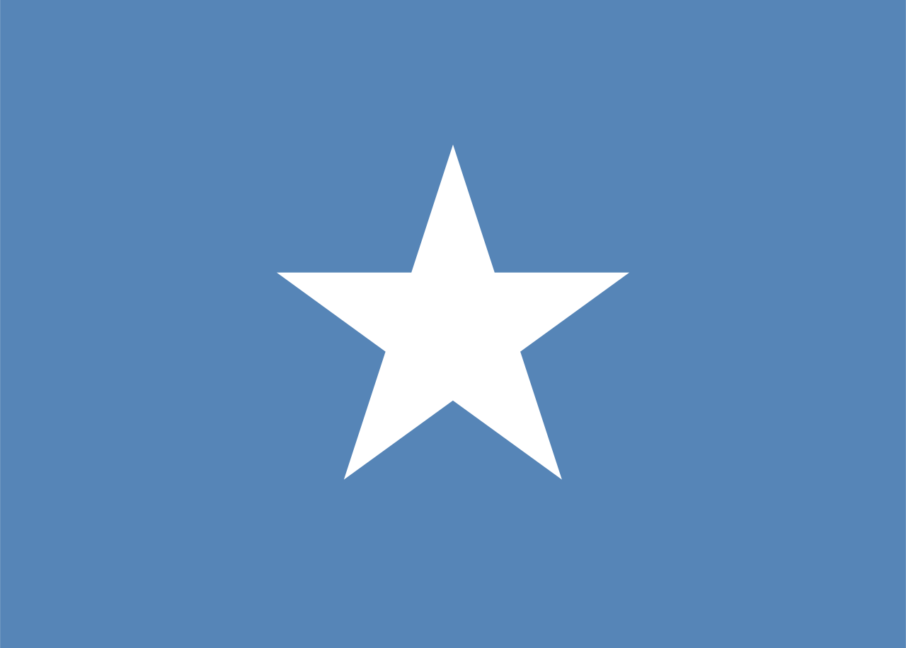

Note:
There were some fine print issues and The Republic of West Florida was established as it's own country _(ha you ain't the only ones to do so Texas!_), before being taken over by the US two and half months later (_oh, uh never mind Texas..._).

## Lazy Florida

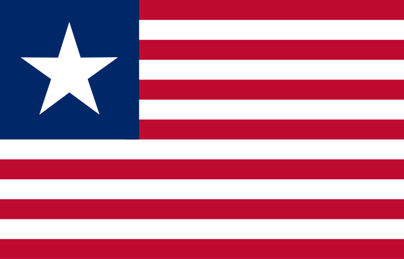

Note:
Then forty years go without an official flag... What!? You had a cool one? You even made one in two and a half months! But you couldn't be bothered to do another for forty years! Fortunately, they did realize they should have flag. So they just decided to use the Texas flag (_oh come on!!!_).

## Confederate Florida

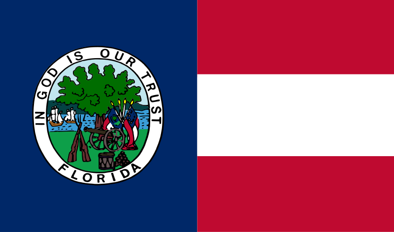

Note:
Next the whole Civil War thing happened. Important things occurred which we won't talk about. Unimportantly, it did convince them to finally put together a flag. Disastrously this set a trend for adding unreadable seals to every flag afterwards.
> Quick aside: This seal, has this flag, in the seal! I know you couldn't see this awful recursion, because it's an overly complex and small thing on a flag! The fact it was hard to tell what flag that is on the seal, is a pretty good indicator, that the seal was a terrible thing to add to the flag!!!

## French Florida

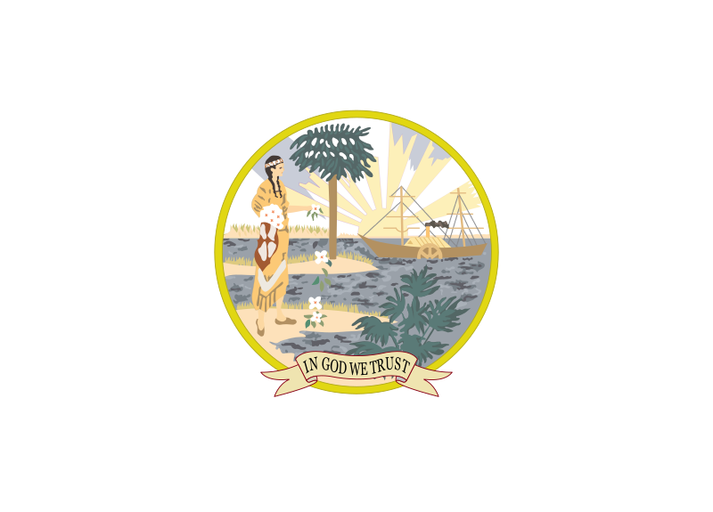

Note:
Eventually Florida surrenders, and they just drop everything but a seal? Like, I know you surrendered, but you don't actually have to change your flag to be mostly white? That's not how that works.
They also realized that was dumb pretty quickly. This time, just thirty years later, they voted to add back that cool red cross from before!

## "It was red right?" Florida

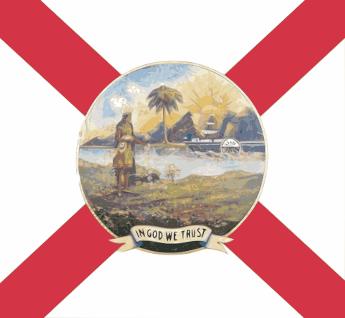

Note:
Which, uhm, you might notice doesn't quite look the same as the first red cross. Well uh, after doing more research than I originally anticipated in order to complain about flowers, I discovered the people of Florida specifically voted to add [St. Andrew's Cross][St. Andrews Cross] to the previous flag.

## St. Andrew's Cross

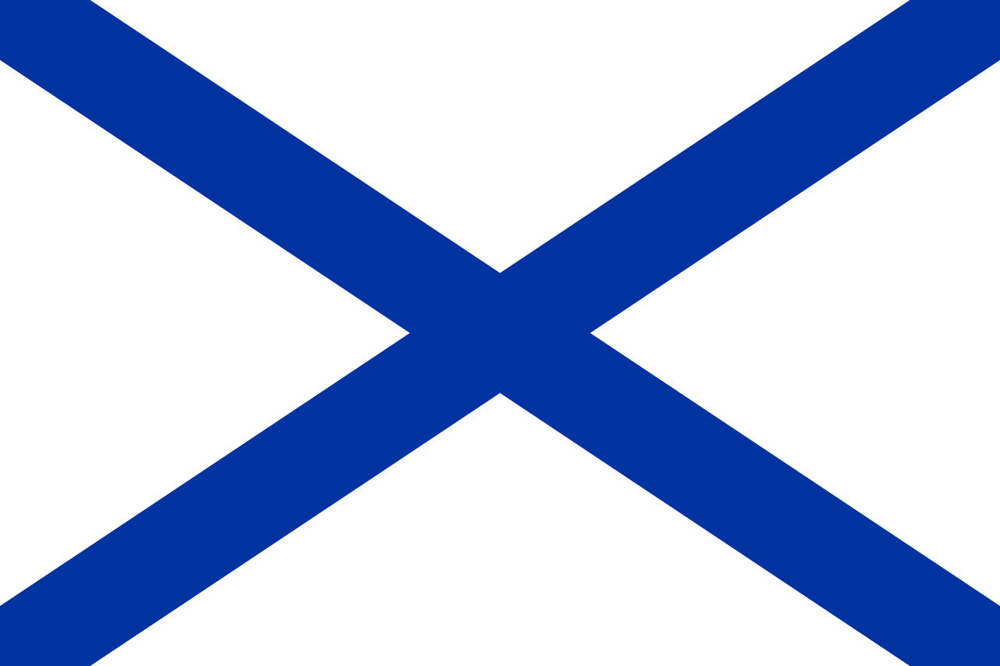

Note:
So St. Andrew's Cross has many interpretations (such as this very blue and very straight one). It basically means there is an X on a flag. Which the Cross of Burgundy technically is. 

## Alabama

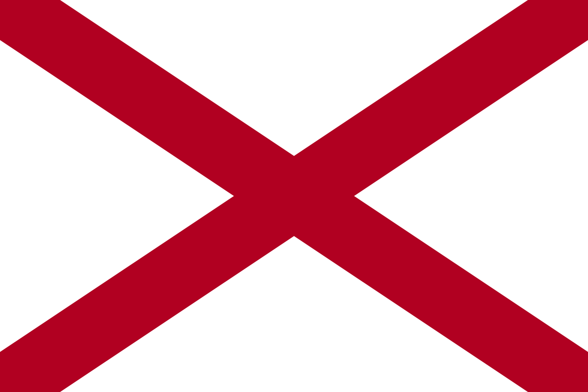

Note:
I couldn't find more info on this, but I think someone just confused the Cross of Burgundy with the design [Alabama][Flag of Alabama] used a few years earlier and just went with it (_Can we please have something original for once!!_).
> On a more serious aside: There is some criticism that the Florida cross might be an homage to a Confederate Battle Flag. There is nothing official about this in the legislation and it isn't a direct copy, so I can't say confidently one way or the other, so for purposes of this, I'm going to assume the more comedic interpretation.

## Florida Seal

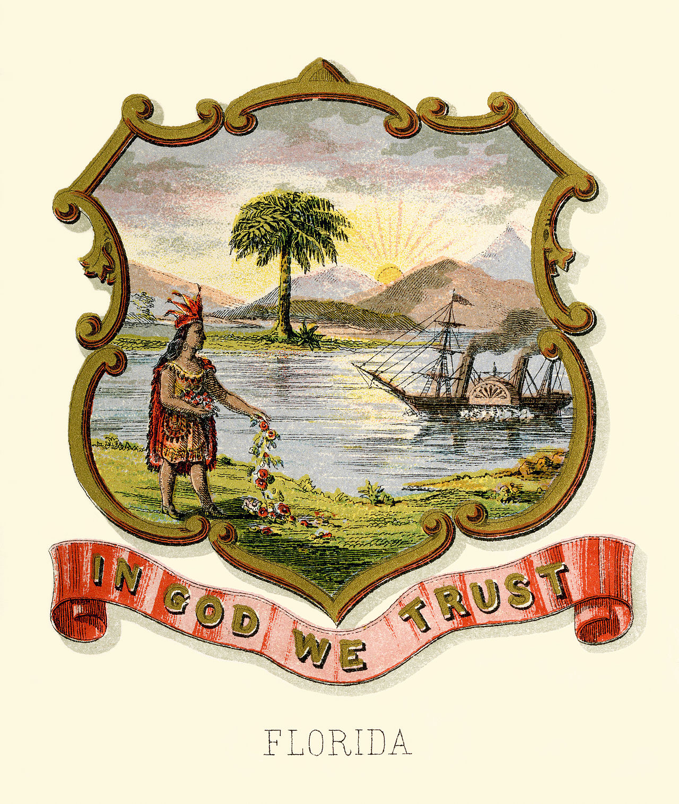

Note:
So after this we get a few iterations of the [seal][Florida Seal] changing, such as removing the mountains in the background, because as you probably know, FLORIDA DOESN'T HAVE MOUNTAINS! They also updated the tree to be a Palm Tree and decided to more accurately portray the Seminole woman, though, they still left out all the genocide.

## Modern Florida

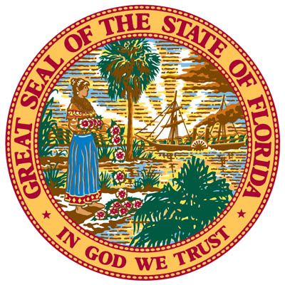

## Modern Florida

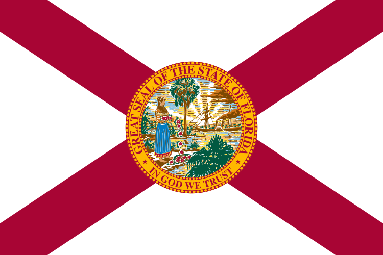

Note:
Finally we arrive at this, the current Florida flag. Which, in-summary, is an inaccurate homage to to some guy who didn't like italics

## Better Florida

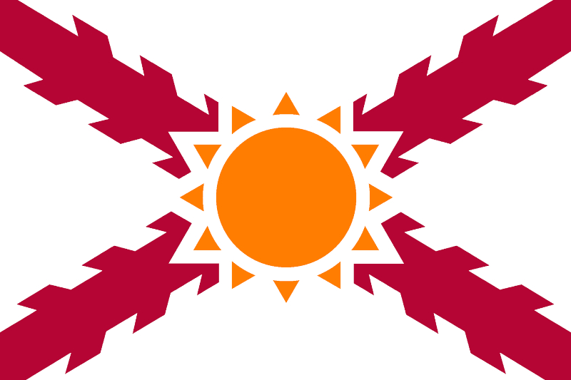

Note:
Oh and before I leave you, [this][Flag Redesign], this should be the Florida flag! It's so pretty and readable and it's an accurate reference and ahhh! It's great. Thank you.

<!-- References -->
[Florida]: https://en.wikipedia.org/wiki/Florida
[Florida Flags]: https://en.wikipedia.org/wiki/Flag_of_Florida
[New Spain]: https://en.wikipedia.org/wiki/New_Spain
[Cross of Burgundy]: https://en.wikipedia.org/wiki/Cross_of_Burgundy
[Burgundy]: https://en.wikipedia.org/wiki/Burgundy
[Charles the Bold]: https://en.wikipedia.org/wiki/Charles_the_Bold
[Fountain of Youth Park]: https://en.wikipedia.org/wiki/Fountain_of_Youth_Archaeological_Park
[St. Andrews Cross]: https://en.wikipedia.org/wiki/St._Andrew%27s_Cross
[Flag of Alabama]: https://en.wikipedia.org/wiki/Flag_of_Alabama
[Florida Seal]: https://en.wikipedia.org/wiki/Seal_of_Florida
[Flag Redesign]: http://sunshinestateinsider.com/ten-great-redesign-ideas-for-floridas-state-flag/
