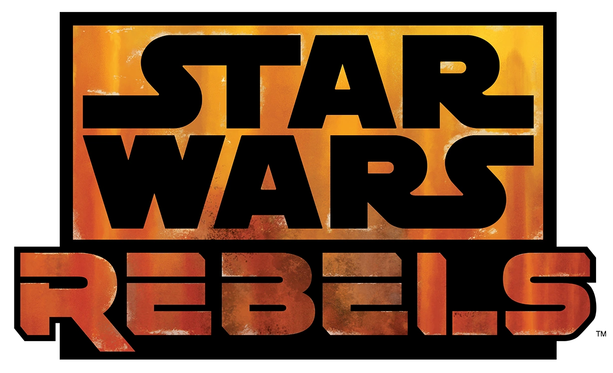
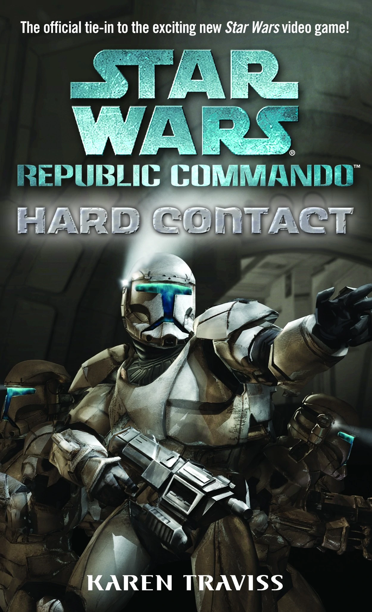
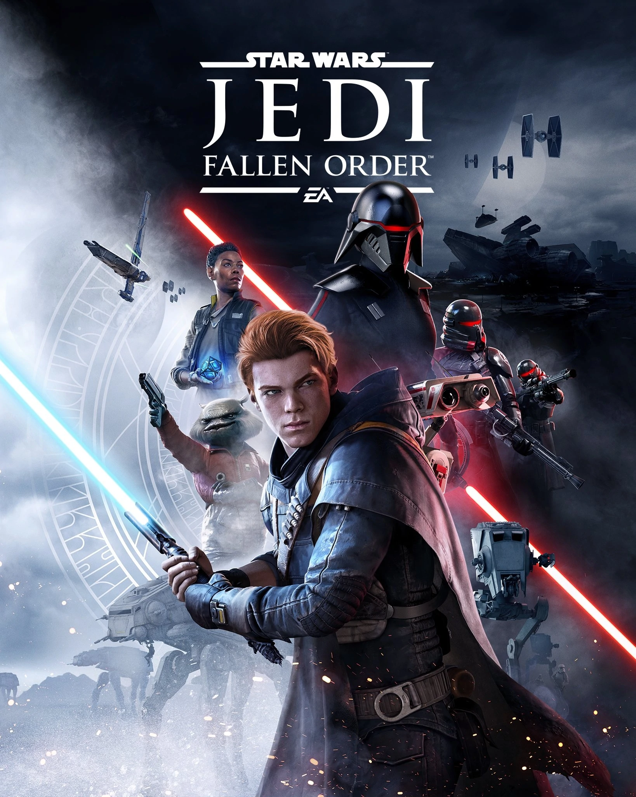

# Star Wars: The Expanded Universe

### An Introduction

<small>By [Matthew Booe](http://www.matthewbooe.com)</small>

Note:
- All images are either from Wookieepedia or from the site of the respective game, group, etc

## About me

## About me

- Read >100 Star Wars books
- Jedi in Training
- More Star Wars thoughts at [codecaptured.com](https://codecaptured.com)

Note:
- Sound impressive, but not like you should belong in Star Wars AA

## Table of Content

- Context
- Shows
- Books
- Video Games
- Comic Books
- Other
- Summary

## Context

- Breadth of stories and genres
- Canon/Legends

Note:
- Not everything is about the characters from the movies, though many are
- Not just space opera/adventure, but primarily are
- Canon refers to "what actually happened" in universe
	- Though all legends is no longer canon, some of legends wasn't canon at the time

## Timeline

- Before the Battle of Yavin (BBY)
- After the Battle of Yavin (ABY)
- Eras roughly defined

Note:
- Battle of Yavin was Episode IV: A New Hope
- Eras before, during, and between the trilogies

## Key

- Rebel Icon <i class="fa fa-rebel" aria-hidden="true"></i> = Legends
- Empire Icon <i class="fa fa-empire" aria-hidden="true"></i> = Not read

Note:
- Enjoy either, just understand there are different timelines
- Anything I've not read, I want to
- Some things weren't meant to be cannon, so I don't mark them

## Shows

## Westerns/Action

The Mandalorian

## Prequels Done Well

The Clone Wars

Alt: Clone Wars <i class="fa fa-rebel" aria-hidden="true"></i>

Note:
- There is a movie, the plot is useful, the movie is not representative of the show quality

## More OT

Rebels

Note:
- Recommend watching The Clone Wars first, as they tie will together

## Comedy

Detours

Note:
- Only short clips, but their a good self aware kind of humor

## Suffering

The Holiday Special <i class="fa fa-rebel" aria-hidden="true"></i>

Note:
- It's not "so bad it's good". It killed part of my soul, and I'm still not recovered. So this is a warning

## Books

## More OT

Lost Stars <i class="fa fa-empire" aria-hidden="true"></i>

Note:
- Star Crossed lovers who find themselves on opposite sides of the war

## After the OT

Thrawn Trilogy <i class="fa fa-rebel" aria-hidden="true"></i>

Alt: Aftermath <i class="fa fa-empire" aria-hidden="true"></i>

Note:
- Thrawn brings the Empire back to threaten the New Republic (such a good character, he now has a new canon trilogy)

## No Hokey Religions

X-Wing series <i class="fa fa-rebel" aria-hidden="true"></i>

Note:
- 10 book series that follows to sets of Star Fighter pilots moping up the Empire

## Solider Perspective

Republic Commando series <i class="fa fa-rebel" aria-hidden="true"></i>

Note:
- Fantastic series about a group of clones, their trainers, and a Jedi or Two trying to survive the Clone Wars. Also a ton of Mandalorian culture

## Jedi, but not Jedi

Dawn of the Jedi <i class="fa fa-rebel" aria-hidden="true"></i>

Note:
- What were the Jedi like when they first started out? Well they carried actual swords and they weren't always the good cops

## Let the Bad Guy Win

Darth Bane Trilogy <i class="fa fa-rebel" aria-hidden="true"></i>

Note:
- Follow Darth Bane as he reforges the Sith for a millennia to come

## Become a Jedi/Sith

The Jedi Path

Alt: Book of Sith

Note:
- "In universe" guides to the light and dark side, with commentary from influential figures like Yoda, Darth Bane, and more

## Horror

Death Troopers <i class="fa fa-rebel" aria-hidden="true"></i> <i class="fa fa-empire" aria-hidden="true"></i>

Alt: Red Harvest <i class="fa fa-rebel" aria-hidden="true"></i> <i class="fa fa-empire" aria-hidden="true"></i>

Note:
- Stuck in a ship full of stormtrooper zombies? Need I say more (and it's prequel)

## Theater

William Shakespeare's Star Wars

Note:
- A retelling of the Skywalker Saga by "Shakespeare"

## Comics

## Luke Joins the Emperor

Dark Empire <i class="fa fa-rebel" aria-hidden="true"></i>

Note:
- So... I don't like how the Emperor came back in the prequels, but it's very well done (if not a little stupid)

## Darth Vader Being Awesome

Darth Vader: Dark Lord of the Sith <i class="fa fa-empire" aria-hidden="true"></i>

Note:
- If you like the scene at the end of Rouge One, this is for you

## Living in the Shadow of the Skywalkers

Legacy <i class="fa fa-rebel" aria-hidden="true"></i>

Note:
- What would it be like to live as the descendant of the Skywalkers? Now imagine that with pseudo-communist Sith controlling the galaxy

## Alternate Reality

Infinities

Alt: The Star Wars

Note:
- Follow several different takes on the Star Wars story, including my favorite, Sith Leia and a blaster wielding C-3PO
- A version of Star Wars based on George Lucas's original script. It works, but boy is it different
- Neither really are cannon or legends

## Comic Strips

Tag And Bink Are Dead

Note:
- Revels who pretend to be Stormtroopers to survive and get caught up in a lot of hijinks
- Not really are cannon or legends

## Video Games

## Action

Jedi: Fallen Order

Alt: Jedi Knight: Jedi Academy <i class="fa fa-rebel" aria-hidden="true"></i> or The Force Unleashed <i class="fa fa-rebel" aria-hidden="true"></i>

Note:
- Fallen Order has a challenging, but rewarding combat system with lots of exploration and a decent story. Expect a sequel
- Jedi Academy has a fun, but sort of dated feel. Probably the most "realistic" combat you could get. Online community is still growing strong
- The Force Unleashed is just pure power fantasy if you wanted to throw around stormtroopers and have a blast

## Shooter

Republic Commando <i class="fa fa-rebel" aria-hidden="true"></i>

Alt: Battlefront series

Note:
- A squad based FPS, it has an awesome take on the clones and combat. Tied into the book series, though stories barely intersect
- Battlefront old is fun and might be my most play game ever
- New Battlefront is much more modern, but just doesn't fit my personal preferences

## Starfighters

Squadrons

Alt: Rogue Squadron Series <i class="fa fa-rebel" aria-hidden="true"></i>

Note:
- A story driven fighter arcade style with high skill ceiling (best enjoyed in VR)
- Fly as Luke Skywalker or his companions running missions against the Empire

## Strategy

Empire At War <i class="fa fa-rebel" aria-hidden="true"></i>

Note:
- Blow up planets as the Empire, smuggle in a commando squad as the Rebellion, or make a nice profit as a crime lord

## Role-Playing

Knights of the Old Republic <i class="fa fa-rebel" aria-hidden="true"></i>

Alt: Knights of the Old Republic II <i class="fa fa-rebel" aria-hidden="true"></i> or The Old Republic <i class="fa fa-rebel" aria-hidden="true"></i>

Note:
- Not just my favorite Star Wars game of all time, but possibly my favorite game of all time
- Amazing story and characters, great world building, fun and challenging combat
- KOTOR II was a little rushed, so the story isn't as well structured (and it was really buggy until a recent patch or use of mods), but an improvement on the first in many regards
- SWTOR isn't really the same, less story or choice impact, but fun for an MMO

## Cringe

Kinect Star Wars

Note:
- This is a rough miss-mash of a game including dance offs, pod racing, and "duels" that were all poorly implemented
- Possibly the wort song "I'm Han Solo" (Jason DeRülo – "Ridin' Solo")

## Other

## Languages

Mando'a

Note:
- A language and alphabet originally designed by Karen Travis (from the Republic Commando author)
- Learn to say fun things like "their brain cell is lonely"

## Costuming/Acting

501st

Alt: Rebel Legion, Mandalorian Mercs, Saber Guild

Note:
- All have resources to help you build or buy a costume. They go to events to raise money for charities
- Saber Guild also does lightsaber duel performances

## Summary

- Shows: The Mandalorian and The Clone Wars
- Books: Lost Stars and The Thrawn Trilogy
- Comics: Darth Vader: Dark Lord of the Sith
- Video Games: Fallen Order and KOTOR

## Questions? 

## Thank you!

<iframe class="r-stretch" src="https://giphy.com/embed/XQ1FwjRKun4nS" frameBorder="0" class="giphy-embed" allowFullScreen></iframe>

Note:
- Ref: https://thisweekinpinball.com/wp-content/uploads/2018/03/IsBHReF.gif
